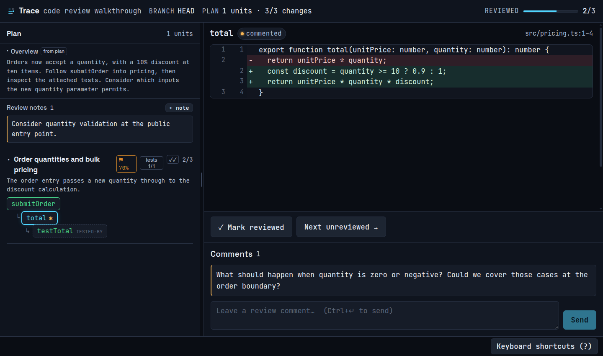

# Structured Review

A guided way to read a large code change, with related code and tests together
and your review progress saved.

A change to one endpoint can involve a controller, a service, a helper and a
handful of tests. Reading those files in alphabetical order leaves you to piece
that story together. Structured Review suggests a reading order from the
code's call relationships, then opens a local browser where you can follow it,
take detours and leave comments.

I built this because I wanted help understanding changes before approving them.
It's useful for reviewing a teammate's work as well as code written by an agent.
Claude Code or Codex prepares the walkthrough; you do the reviewing.

**Experimental alpha, in active use.** TypeScript/JavaScript, Python and Java are
supported, with limitations below. Feedback about confusing reviews and awkward
first-use experiences is especially welcome.



*A small order-pricing review. Run `pnpm demo` to try it yourself.*

## Try it

You'll need **Node >= 22.13**, **npm** and **Git**. Linux and macOS are supported;
Windows is not currently supported. Indexers download from npm on first use.

### Claude Code

```text
/plugin marketplace add samisandqvist/structured-review
/plugin install structured-review@structured-review
```

Then ask:

> Use structured-review to review my current changes against main and open the review.

Replace `main` with your base branch. The agent starts the local server, prepares
a plan and gives you a browser link. The first run may take a minute to install
the TypeScript and Python indexers. If installation fails, fix the reported npm
or network problem and retry the same command.

Update with `/plugin update structured-review@structured-review`.

### Codex

Add this repository's marketplace from a terminal:

```bash
codex plugin marketplace add samisandqvist/structured-review
```

In Codex CLI, open `/plugins`, install **structured-review** from
**structured-review**, and start a new session. Ask:

> Use $structured-review to review my current changes against main and open the review.

For a local checkout, use `codex plugin marketplace add /absolute/path/to/structured-review`.
The package lives at `plugins/structured-review`; the catalog is
`.agents/plugins/marketplace.json`. The local runtime requires access to your
checkout and a browser on the same machine. This package is intended for local
Codex use; it does not provide a hosted ChatGPT review service.

Both packages use the same CLI, UI and skill instructions. The Codex launcher
checks dependencies when needed, without requiring a startup hook. See OpenAI's
[plugin documentation](https://developers.openai.com/plugins/build/plugins)
for marketplace setup and supported hosts.

### From source — including a small example

Install **pnpm 10.15.1** (`npm install --global pnpm@10.15.1`), then:

```bash
git clone https://github.com/samisandqvist/structured-review.git
cd structured-review
pnpm install --frozen-lockfile
pnpm build
pnpm demo
```

`pnpm demo` creates a temporary example repository and prints its review URL.
It adds order quantities and bulk discounts: follow the order function into
pricing, inspect the tests, and consider which inputs are missing validation.
It uses a separate port and database. The output includes a command to stop
its server; the temporary files remain available for inspection.

To review your own working tree from this checkout:

```bash
node packages/skill/dist/cli.js serve --repo /absolute/path/to/your-repo
node packages/skill/dist/cli.js session create --branch HEAD --base main
# Substitute the sessionId printed by the previous command:
node packages/skill/dist/cli.js plan --session <sessionId> --auto --open
```

This is also usable without an agent: `--auto` generates a mechanical plan.
If the default port is busy, pass the same `--port N` to each command.

## Walking a review

Start with the overview and unit names. Select a change to read its diff, or
press `j` to begin. Follow a caller or callee when you need context; **Return to
review walk** brings you back. Related tests and supporting changes appear with
the code they belong to.

Click a changed line number to anchor a comment; Shift-click another changed
line to select a range. Sending a node comment marks that node reviewed with a
comment. **Review notes** hold broader concerns, such as an unfamiliar directory
layout, missing behavior or a design question that belongs to the whole change.
Each comment and note has edit (✎) and delete (✕) buttons; editing keeps the
line anchor, and deleting a node's last comment sets the node back to reviewed
without a comment.

Mark changes reviewed as you go. The counters record those marks; they aren't a
correctness score. When you're done, ask the agent to collect the comments, or run:

```bash
node packages/skill/dist/cli.js comments --session <sessionId> --pretty
```

Comments include file and line information for mapping to a GitHub review.
Publishing them to GitHub is a separate step.

### Keyboard shortcuts

| Key | Action |
| --- | --- |
| `j` / `k` | Next / previous change, wrapping around the walk |
| `n` | Next unreviewed change |
| `r` | Mark the current change reviewed and advance |
| `c` | Focus the comment box |
| `?` | Show or hide keyboard help (also available as a button) |
| `Esc` | Close keyboard help; cancel a review-note draft or a comment edit |
| `Ctrl+Enter` / `Cmd+Enter` | Send a comment or review note; save a comment edit |

Navigation shortcuts pause while you're typing or using a dropdown. You can
also drag the divider to give the diff or the plan more room. Double-click a
unit name to rename it; drag a unit onto another to reorder the plan.

## Take a step back before following the calls

A readable implementation can still introduce the wrong abstraction or put a
feature in an unexpected part of the project. Before following functions, look
at the new directories, moved files, dependencies and public interfaces. Compare
a new feature with an established one and with the project's documented conventions.

The walkthrough helps with behavior and navigation. It doesn't yet provide a
before/after directory view or check architectural conventions. Use review notes
to keep those questions visible. [Ideas for improving this part of review](docs/review-experience-direction.md)
describe possible additions; they are proposals, not shipped features.

## What the review includes

- The current **tracked working tree** against the supplied base ref, including
  staged and unstaged edits. `--branch` must be `HEAD` or the checked-out branch.
- Changed functions and methods, plus text changes outside the graph (imports,
  types, configuration, docs and unindexed code) as per-file review items.
- A visible **Unassigned changes** group for items a plan hasn't placed.
- Inferred call relationships, related tests, per-unit progress, line comments
  and review-wide notes. Plan-authored descriptions are labeled **from plan**.

**Limits to keep in mind:**

- New **untracked files are excluded**. Stage files you intend to include, then
  create the session. File-mode-only changes and pure renames without text hunks
  are not represented as review items. Binary changes have no dedicated viewer.
- Call relationships are inferred from static references, not recorded execution.
  Some references are not calls; framework callbacks and dependency injection
  can obscure entry points. You can [configure entry points](docs/cli-and-configuration.md#entry-point-configuration).
- A multi-language session combines separate language indexes; it doesn't trace
  requests across processes or service boundaries.
- A session is not an immutable copy of your source. If the working tree changes,
  the UI checks freshness every five seconds while active and on window focus.
  Recreate a stale session before continuing; its marks describe the earlier code.
- “Reviewed” means a person marked the item. It doesn't establish test coverage,
  architectural fit, security or correctness.

| Language | Indexing setup |
| --- | --- |
| TypeScript / JavaScript | scip-typescript, installed automatically by the plugin |
| Python | scip-python, installed automatically by the plugin |
| Java | scip-java; requires coursier (`cs`), a JDK and Maven on PATH |

Missing Java tooling produces a visible warning and a text-only review of the
affected changes. Install the tools and recreate the session for call relationships.

## Local data

The review hub runs on loopback (`127.0.0.1`) and stores comments and progress
in SQLite. It has no authentication; keep it on your own machine.
It accepts only loopback hostnames and rejects foreign browser origins and
cross-site requests. JSON write endpoints require `Content-Type: application/json`.
These checks protect the browser boundary; local processes can still use the API.

Review only repositories and build configurations you trust. Java indexing runs
the project's build (including build plugins); indexing is not sandboxed.

Plugin state uses the host's writable plugin data directory when available,
otherwise `~/.local/share/structured-review` (or `XDG_DATA_HOME`).
`SREV_DATA_DIR` overrides that location. From source, state defaults to `review.db`
and `.srev/` in the reviewed repository. `srev gc` removes a repository's review data.

The hub has no telemetry or model API calls. Indexer installation downloads
packages, and Java tooling may download build dependencies. If you use Claude
Code or Codex to prepare a review, the source/context those agents read is subject
to that product's data handling; using a local hub doesn't make the agent offline.
The browser also requests display fonts from Google Fonts.

## Development and help

```bash
pnpm dev          # server :3456 and Vite :5173, with hot reload
pnpm test         # unit, component and integration tests, including real indexers
pnpm typecheck
pnpm build
pnpm build:plugin # rebuild both committed host packages after runtime changes
pnpm verify       # aggregate quality checks; see setup prerequisites below
```

CI runs type, formatting, lint/complexity, architecture, test/coverage, build,
plugin freshness, browser, and security checks. Existing debt is recorded in
explicit baselines; passing CI does not mean every strict target is met.
See the [quality harness guide](docs/harness.md) for verification prerequisites,
coverage policies, and commands. PRs and pushes to `main` run ordinary verification;
Mondays run only the security refresh/check job. The full platform and mutation
workflow is available manually.

If the server isn't reachable, restart it with `srev serve`. If it reports a busy
port, use another `--port` consistently. If your base ref doesn't resolve, check
its spelling and that it's available locally. Indexer warnings name the missing
toolchain; installation errors can be retried after fixing npm or network access.

- [CLI, environment variables, plan and export reference](docs/cli-and-configuration.md)
- [Agent skill and plan authoring](packages/skill/skill.md)
- [Contributor architecture and commands](AGENTS.md)
- [Design notes](docs/)
